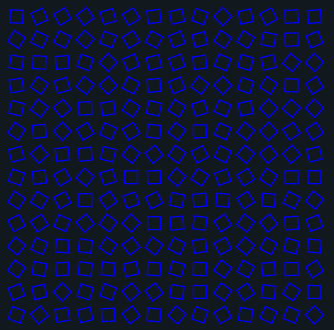
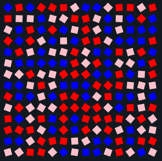
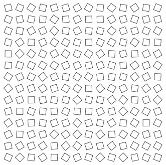
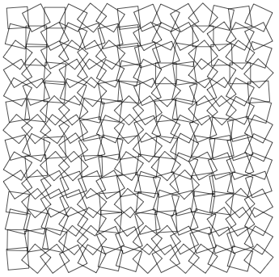
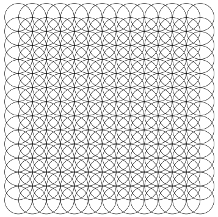
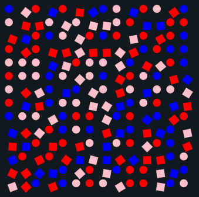
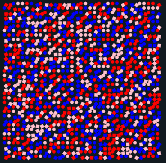
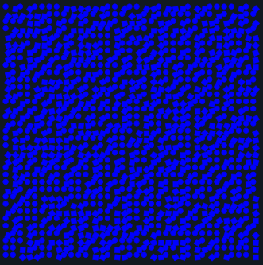

# Generative Angular - First Steps

Everybody seems to be into generative art these days so I thought I gave it a go. 
Picking a framework or platform can be overwhelming - should I use Processing, p5.js, Greensock... 
Canvas, SVG, WebGL, plain css, houdini?? I know myself, if I dwell on this for too long I will loose 
interest and move on to the next shiny thing before finishing anything. So to make a headstart 
I am sticking to the tool I know best (angular and RXJS) and see how far that brings me in 
combination with SVG. Turns out quite far as SVG and RXJS seem to complement each other really well.

Here are some examples.

&nbsp;

&nbsp;

&nbsp;

&nbsp;

&nbsp;

&nbsp;

&nbsp;

## Make your own

The application allows you to create your own art (there I said it). Have a look at [https://david-bulte.github.io/generative-angular/](https://david-bulte.github.io/generative-angular/) (best viewed on desktop) and have fun!

## Lessons Learned

### Angular and SVG
todo

### Github pages
Autodeploying a project to github-pages with github actions is still somewhat obscure to me. [This](https://dev.to/rodrigokamada/hosting-an-angular-application-on-github-pages-using-github-actions-5ag8) article and the accompanying repo helped me a lot.

## Next steps

- Finish 'Lessons Learned'
- Make more mobile-friendly
- Add some validation
- Watching rectangles and circles dance on screen is nice, my next goal though is to print them on paper
(and end up in a museum haha). So watch out this space for some pen plotter experiments. 
